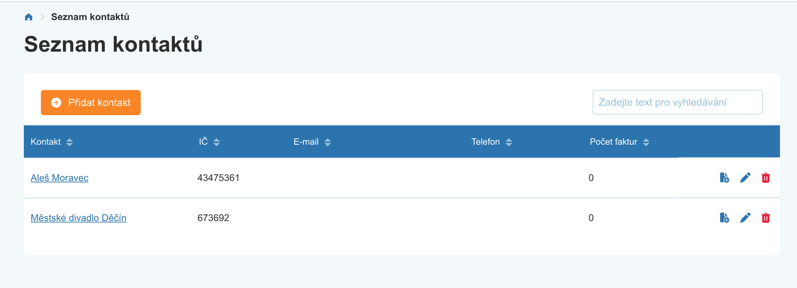

# Frontend developer

## Intro
Tvým úkolem je vytvoření Vue aplikace s napojením na GraphQL pomocí ApolloClienta.
Řešení nahraj na github a pošli odkaz na repozitář.

## Zadání
Vytvoř jednoduchou CRUD aplikaci pro správu klientů s pár featurama navíc.

Jelikož hledáme frontenďáka s přesahem do cssek tak by výsledná appka měla být podobná screenům.

Nad zadáním se zamysli a před vypracováním nám prosím pošli tvůj orientační odhad pracnosti
v hodinách. Po vypracování tě pak poprosíme o počet hodin, které jsi na vypracování opravdu
využil.

Jako UI Library používáme ElementUI, formy, tabulky a validace vytvoř pomocí Elementu.
Všechny závislosti které budeš potřebovat jsou již nainstalovány.

# GraphQL
Ve složce server je připravený jednoducý server se sample daty, vytvoř frontend, ktery bude komunikovat s GraphQL.
CompanyInfo není ideální, data se musí získlat přes allCompanyInfos, ale určite si poradíš ;)

- GraphiQL
  - `yarn start:server`
  - `http://localhost:4000/graphql`

## Seznam klientů

Funkcionalita
- Vyhledávání
- Řazení podle sloupců
- Stránkování

## Vytvoření klienta

Funkcionalita
- Validace
- Načtení dat podle jména
- Načtení dat podle IČ

## Detail klienta (slouží jako show/edit)

Funkcionalita
- Validace
- Načtení dat podle jména
- Načtení dat podle IČ
- Zahození změn / vrácení zpět na index
- Možnost přenačtení dat podle IČ
- Vypsání faktur klienta
  - vyhledávání
  - zobrazování jen zaplacených
  - řazení podle sloupců
  - stránkování
